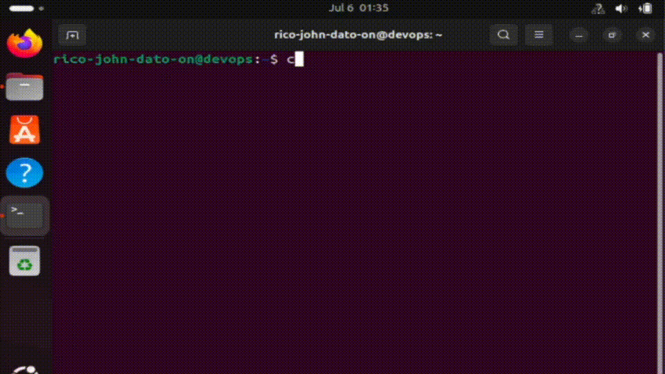
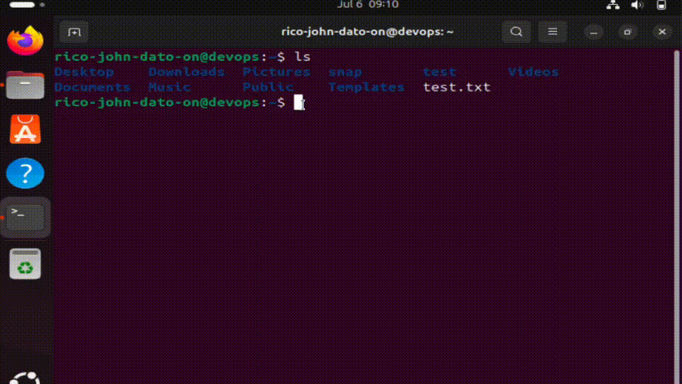
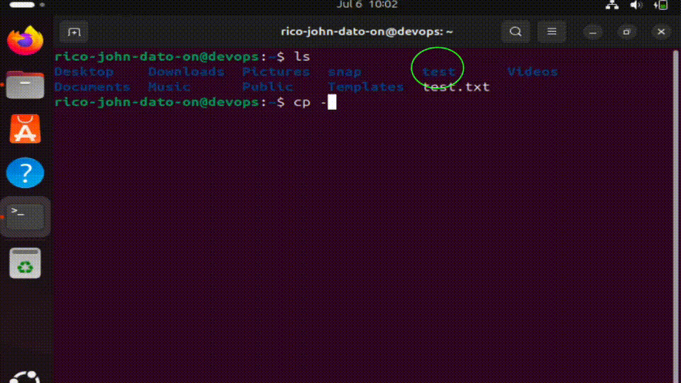
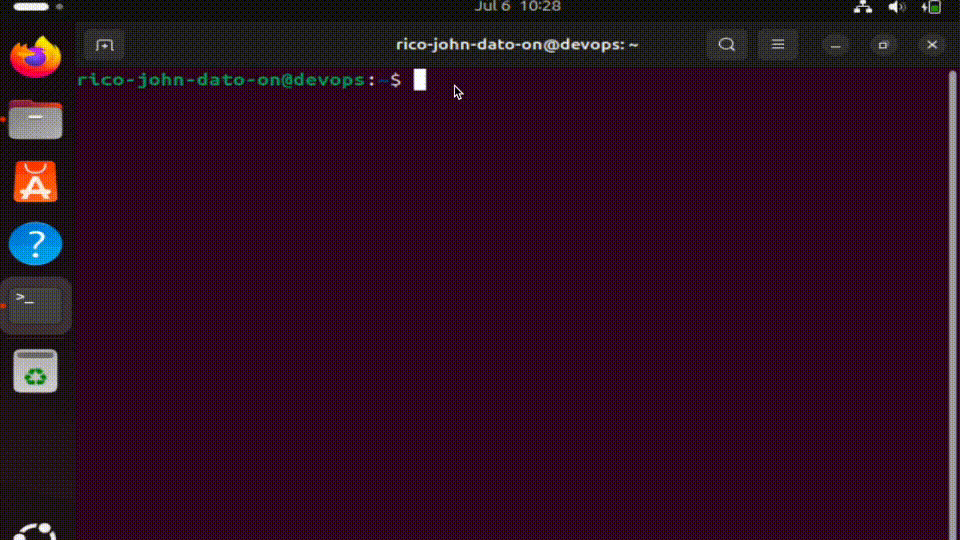
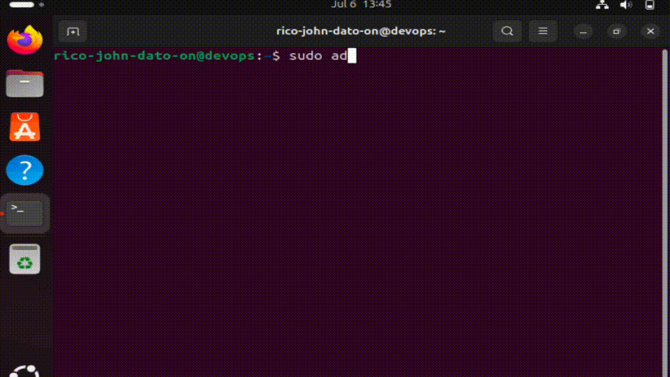

# 🧰 Basic Linux Commands

This guide contains essential Linux terminal commands for navigating the file system, managing files and directories, viewing system info, and using superuser privileges. Perfect for DevOps, system administration, and daily terminal usage.

---

## 📁 Navigation


### Show Current Directory

```bash
pwd
```

### List Contents

```bash
ls
```

### Change Directory

```bash
cd Documents
```

### Go Up One Level

```bash
cd ..
```

---

## 🛠 File & Folder Operations


### Create a Directory

```bash
mkdir test
```

### Create a File

```bash
touch test.txt
```

### Remove a File

```bash
rm test.txt
```

### Remove a Directory

```bash
rm -r test
```

---

## 🧭 Paths: Absolute vs Relative



### Absolute Path

```bash
cd /etc/network
```

### Relative Path

```bash
cd Documents
```

---

## ⚡ Terminal Productivity Tips


- **Autocomplete:** Press `Tab`
- **Command History:** `history`
- **Reverse Search:** `Ctrl + R`
- **Cancel Command:** `Ctrl + C`
- **Paste in Terminal:** `Ctrl + Shift + V`

---

## 📄 Viewing File Contents


### View a Text File

```bash
cat test.txt
```

### View Command History File

```bash
cat ~/.bash_history
```

---

## 📂 Hidden Files


### List All Files Including Hidden

```bash
ls -a
```

---

## 🔁 Rename Files and Folders



### Rename Folder

```bash
mv test test1
```

### Rename File

```bash
mv test.txt test1.txt
```

---

## 📋 Copy Files and Folders



### Copy Folder Recursively

```bash
cp -r source_folder destination_folder
```

### Copy File

```bash
cp file1.txt file2.txt
```

---

## 💻 System Info Commands



### Kernel and System Info

```bash
uname -a
```

### OS Release Info

```bash
cat /etc/os-release
```

### CPU Info

```bash
cat /proc/cpuinfo
```

### Memory Info

```bash
cat /proc/meminfo
```

---

## 🔐 Superuser and Sudo



### Create User

```bash
sudo adduser test
```

### Switch User

```bash
su -test
```

### Delete User

```bash
sudo deluser test
```

### Create Group

```bash
sudo addgroup test
```

### Delete Group

```bash
sudo groupdel test
```

---

## ✅ Summary

These commands are foundational to working with Linux systems via the terminal. Whether managing files, navigating the system, or using sudo for admin tasks — these are the essential tools for everyday Linux usage.

---

🧑‍💻 *Created by Rico John Dato-on*🧑‍💻 _Created by Rico John Dato-on_  
🔗 [LinkedIn](https://www.linkedin.com/in/rico-john-dato-on) • [Portfolio](https://ricodatoon.netlify.app)
