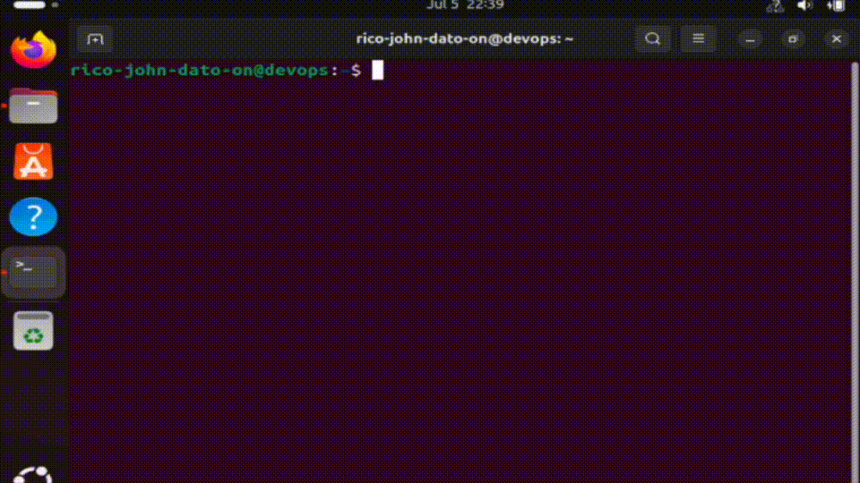
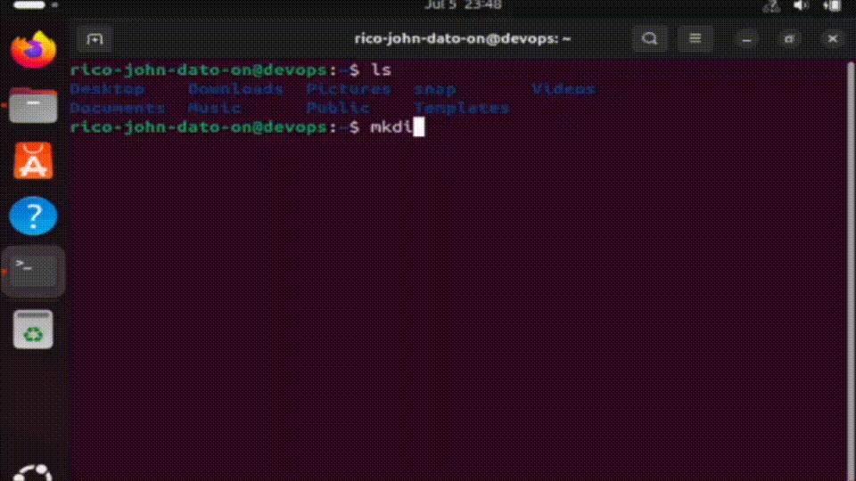

# 🧰 Basic Linux Commands

This guide contains essential Linux terminal commands for navigating the file system, managing files and directories, viewing system info, and using superuser privileges. Perfect for DevOps, system administration, and daily terminal usage.

---

<details>
<summary>📁 Navigation</summary>



### Show Current Directory

```bash
pwd
```

### List Contents

```bash
ls
```

### Change Directory

```bash
cd Documents
```

### Go Up One Level

```bash
cd ..
```

</details>

---

<details>
<summary>🛠 File & Folder Operations</summary>



### Create a Directory

```bash
mkdir my_folder
```

### Create a File

```bash
touch myfile.txt
```

### Remove a File

```bash
rm myfile.txt
```

### Remove a Directory

```bash
rm -r my_folder
```

</details>

---

<details>
<summary>🧭 Paths: Absolute vs Relative</summary>

### Absolute Path

```bash
cd /etc/network
```

### Relative Path

```bash
cd Documents
```

</details>

---

<details>
<summary>⚡ Terminal Productivity Tips</summary>

- **Autocomplete:** Press `Tab`
- **Command History:** `history`
- **Reverse Search:** `Ctrl + R`
- **Cancel Command:** `Ctrl + C`
- **Paste in Terminal:** `Ctrl + Shift + V`

</details>

---

<details>
<summary>📄 Viewing File Contents</summary>

### View a Text File

```bash
cat filename.txt
```

### View Command History File

```bash
cat ~/.bash_history
```

</details>

---

<details>
<summary>📂 Hidden Files</summary>

### List All Files Including Hidden

```bash
ls -a
```

</details>

---

<details>
<summary>🔁 Rename or Move Files and Folders</summary>

### Rename Folder

```bash
mv old_folder new_folder
```

### Rename File

```bash
mv old_file.txt new_file.txt
```

</details>

---

<details>
<summary>📋 Copy Files and Folders</summary>

### Copy Folder Recursively

```bash
cp -r source_folder destination_folder
```

### Copy File

```bash
cp file1.txt file2.txt
```

</details>

---

<details>
<summary>💻 System Info Commands</summary>

### Kernel and System Info

```bash
uname -a
```

### OS Release Info

```bash
cat /etc/os-release
```

### CPU Info

```bash
cat /proc/cpuinfo
```

### Memory Info

```bash
cat /proc/meminfo
```

</details>

---

<details>
<summary>🔐 Superuser and Sudo</summary>

### Create User

```bash
sudo adduser newusername
```

### Create Group

```bash
sudo addgroup devops
```

### Switch User

```bash
su - newusername
```

</details>

---

## ✅ Summary

These commands are foundational to working with Linux systems via the terminal. Whether managing files, navigating the system, or using sudo for admin tasks — these are the essential tools for everyday Linux usage.

---

🧑‍💻 _Created by Rico John Dato-on_
